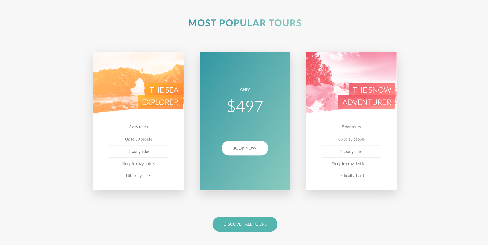

# Tours App

RESTful API design and development with advanced features.
Express (Node.js framework): routing, middleware, sending responses, etc.
Server-side website rendering (HTML) with Pug templates
Advanced MongoDB: geospatial queries, aggregation pipeline, and operators.
Advanced Mongoose features: modeling geospatial data, populates, virtual populates, indexes, etc.
Using the MVC (Model-View-Controller) architecture.

